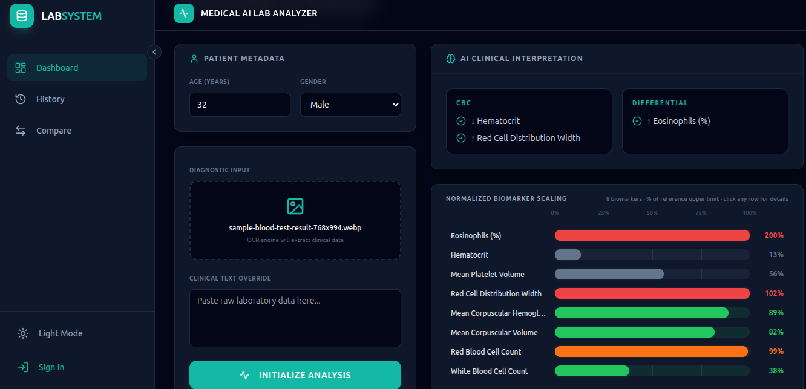

## Table of Contents

1. [Project Overview](#1-project-overview)
   - [Why It Was Built](#why-it-was-built)
   - [Key Features](#key-features)
2. [Target Audience](#2-target-audience)
3. [Technology Stack](#3-technology-stack)
4. [Tools Used](#4-tools-used)
5. [Project Structure](#5-project-structure)
6. [Local Setup (Step by Step)](#6-local-setup-step-by-step)
   - [Prerequisites](#prerequisites)
   - [Step 1 — Clone the Repository](#step-1----clone-the-repository)
   - [Step 2 — Environment Setup](#step-2----environment-setup)
   - [Step 3 — Start the Backend (Docker)](#step-3----start-the-backend-docker)
   - [Step 4 — Database Migrations](#step-4----database-migrations-first-time-only)
   - [Step 5 — Start the Frontend](#step-5----start-the-frontend)
   - [Step 6 — Open the Application](#step-6----open-the-application)
7. [Troubleshooting](#7-troubleshooting)
8. [Features in Detail](#8-features-in-detail)


## Medical AI Lab Analyzer

**Medical AI Lab Analyzer** — A full-stack RAG-powered web app that lets users upload lab reports (image/PDF), extracts data via OCR, matches test names using FAISS semantic search, retrieves clinical context from a medical knowledge base, and generates plain-English AI explanations for abnormal values.

## 1. Project Overview

Medical AI Lab Analyzer is a full-stack RAG-powered web application that helps patients understand their blood test and lab reports. Users upload a lab report (image or PDF), and the system extracts the text using OCR, identifies each test via FAISS-based semantic search against a medical knowledge base, retrieves relevant clinical context using Retrieval-Augmented Generation (RAG), compares values against reference ranges, and generates plain-English explanations for abnormal results using AI.

**Why it was built**

Medical lab reports are full of jargon, abbreviations, and reference ranges that most people find confusing. Doctors are busy and often cannot spend time walking through every value with a patient. This application bridges that gap by providing instant, personalized explanations of lab results in simple language. It empowers patients to understand their own health data, helps clinics offer faster follow-up, and gives health-conscious individuals a tool to track changes over time.

**Key Features**

- Upload lab reports as PNG, JPG, PDF, WEBP, BMP, TIFF, or HEIC images
- OCR text extraction (Tesseract for images, PyMuPDF for PDFs)
- RAG-powered test identification — FAISS vector search + sentence-transformers embeddings for fuzzy matching of 200+ lab tests
- Clinical knowledge retrieval — Semantic search over indexed medical patterns, test definitions, and reference data to enhance AI context
- Normal / High / Low classification per test
- AI-generated explanations for abnormal results (Gemini 1.5 Flash primary, Groq Llama-3.3-70B fallback) enriched with retrieved clinical context via RAG
- Side-by-side comparison of two reports to track health over time
- Full analysis history for authenticated users
- Email/password signup with email verification
- Google OAuth 2.0 login
- Password reset via email
- Credential-based credit system (5 free analyses on signup)
- Dark and light mode
- Responsive design for desktop and mobile
- CSRF protection, rate limiting, brute-force lockout, and security headers

---

## 2. Target Audience

- **Patients** who receive lab reports and want to understand what each value means without waiting for a doctor's appointment
- **Doctors and clinics** who want to provide patients with automated follow-up explanations after blood work
- **Health-conscious individuals** tracking biomarkers over time to monitor diet, exercise, or supplement effects
- **Medical students** learning to interpret lab values and reference ranges in a practical, hands-on way

---

## 3. Technology Stack

| Layer | Technology |
|---|---|
| Backend Framework | FastAPI 0.136 (Python 3.12) |
| Database | PostgreSQL 16 (via SQLAlchemy 2.0 + Alembic migrations) |
| Cache / Message Queue | Redis 7 + Celery 5 for background task processing |
| AI / LLM | Google Gemini 1.5 Flash (primary), Groq Llama-3.3-70B (fallback) |
| OCR | Tesseract OCR (images), PyMuPDF (PDFs) |
| Vector Search | FAISS + sentence-transformers (semantic test matching) |
| Frontend | React 18, TypeScript, Vite 5, Tailwind CSS 3, Recharts |
| Authentication | JWT (python-jose), Google OAuth 2.0, bcrypt / passlib |
| Email | smtplib (Gmail SMTP for verification and password reset) |
| Deployment | Docker, docker-compose (multi-service orchestration) |

---

## 4. Tools Used

- **VS Code** -- primary development environment
- **Docker Desktop** -- local containerization and service orchestration
- **Postman** -- API endpoint testing during development
- **Git / GitHub** -- version control and collaboration
- **Railway / Render** -- deployment targets for production hosting
- **Google Cloud Console** -- OAuth 2.0 client ID configuration
- **Groq Console** -- LLM API key for Groq inference
- **Google AI Studio** -- Gemini API key generation

---

## 5. Project Structure

```
medical-analyzer/
├── api/
│   └── main.py                  # FastAPI app, all REST endpoints
├── core/
│   ├── auth.py                  # JWT creation/verification, bcrypt hashing, OAuth
│   ├── celery_app.py            # Celery application configuration
│   ├── classifier.py            # Numeric value classification (normal/high/low)
│   ├── database.py              # SQLAlchemy engine and session factory
│   ├── email.py                 # Email sending (verification, password reset)
│   ├── embeddings.py            # Sentence-transformer embeddings for RAG
│   ├── models.py                # SQLAlchemy ORM models (User, Analysis, etc.)
│   ├── normalization.py         # Test name and unit normalization logic
│   ├── ocr.py                   # OCR text extraction from images and PDFs
│   ├── parser.py                # Raw text to structured test data
│   ├── patient_metadata.py      # Extract patient age/gender from text
│   ├── pipeline.py              # Full analysis pipeline orchestration
│   ├── rag_init.py              # RAG system initialization with FAISS
│   ├── redis_client.py          # Redis connection helper
│   ├── resolver.py              # Fuzzy test name matching with known tests
│   ├── schemas.py               # Pydantic/schema classes for pipeline
│   ├── tasks.py                 # Celery background task definitions
│   ├── utils.py                 # JSON sanitization and helpers
│   └── vector_store.py          # FAISS vector store operations
├── medical/
│   ├── clinical_kb.py           # Clinical knowledge base queries
│   ├── clinical_kb.json         # JSON knowledge base data
│   ├── clinical_rules.py        # Clinical correlation rules
│   ├── explainer.py             # LLM explanation generation (Gemini + Groq)
│   ├── lab_reference_dataset.json  # Reference range dataset
│   ├── normalizer.py            # Medical term normalization
│   └── reference_db.py          # Reference range database and lookups
├── services/
│   ├── comparison_service.py    # Side-by-side report comparison logic
│   └── insights_service.py      # Grouped insights generation
├── frontend/
│   ├── src/
│   │   ├── pages/               # React page components
│   │   ├── components/          # Reusable UI components
│   │   ├── lib/                 # Hooks, auth context, utilities
│   │   ├── api.ts               # Axios API client
│   │   ├── router.tsx           # React Router configuration
│   │   ├── main.tsx             # Application entry point
│   │   └── styles.css           # Global styles (Tailwind)
│   ├── package.json
│   ├── vite.config.ts
│   └── tailwind.config.ts
├── alembic/                     # SQLAlchemy database migrations
│   ├── versions/
│   └── env.py
├── tests/                       # Backend test suite
├── data/                        # Generated vector store data (gitignored)
├── Dockerfile                   # Multi-stage Docker build
├── docker-compose.yml           # Service orchestration (4 containers)
├── requirements.txt             # Python dependencies
└── .env.example                 # Environment variable template
```

---

## 6. Local Setup (Step by Step)

### Prerequisites

- Docker Desktop: [https://docs.docker.com/get-docker/](https://docs.docker.com/get-docker/)
- Node.js 18+: [https://nodejs.org/](https://nodejs.org/)
- Git: [https://git-scm.com/](https://git-scm.com/)

### Step 1 -- Clone the Repository

```bash
git clone https://github.com/YOUR_USERNAME/medical-analyzer.git
cd medical-analyzer
```

### Step 2 -- Environment Setup

Copy the example environment file and fill in the required values:

```bash
cp .env.example .env
```

| Variable | Description | Where to Get It |
|---|---|---|
| `GROQ_API_KEY` | LLM API key for Groq fallback | Free at [groq.com](https://groq.com) |
| `GEMINI_API_KEY` | Primary LLM API key | Free at [aistudio.google.com](https://aistudio.google.com) |
| `GOOGLE_CLIENT_ID` | Google OAuth client ID | [console.cloud.google.com](https://console.cloud.google.com) |
| `SECRET_KEY` | JWT signing secret | Run `python3 -c "import secrets; print(secrets.token_hex(32))"` |
| `SMTP_EMAIL` | Gmail address for sending emails | Your Gmail address |
| `SMTP_PASSWORD` | Gmail app password | Generate at [myaccount.google.com/apppasswords](https://myaccount.google.com/apppasswords) |

### Step 3 -- Start the Backend (Docker)

```bash
docker compose up
```

This starts four containers:

- **medical_postgres** -- PostgreSQL 16 database
- **medical_redis** -- Redis 7 cache and message broker
- **medical_api** -- FastAPI application (port 8000)
- **medical_celery** -- Celery worker for background analysis tasks

Watch the logs until you see these messages:

```
medical_postgres | ready to accept connections
medical_redis    | Ready to accept connections
medical_api      | Application startup complete
medical_celery   | celery@... ready
```

### Step 4 -- Database Migrations (First Time Only)

Open a second terminal and run:

```bash
docker compose exec fastapi alembic upgrade head
```

This creates the required tables (`users`, `analyses`, `credit_transactions`, `refresh_tokens`).

### Step 5 -- Start the Frontend

```bash
cd frontend
npm install
npm run dev
```

### Step 6 -- Open the Application

Open your browser and go to:

```
http://localhost:5173
```

### Stopping the Project

```bash
docker compose down
```

Press Ctrl+C in the frontend terminal to stop Vite.

---

## 7. Troubleshooting

### Port 8000 Already in Use

```bash
sudo lsof -i :8000
sudo kill -9 $(sudo lsof -t -i:8000)
```

If you have a local Redis running:

```bash
sudo service redis-server stop
```

### Docker Not Running

```bash
sudo systemctl start docker
sudo usermod -aG docker $USER
```

Log out and back in after the usermod command.

### Database Connection Error

```bash
docker compose down
docker compose up -d postgres redis
docker compose exec postgres psql -U med_user -d medical_db -c "\l"
```

### Google Login Not Working

- Verify `GOOGLE_CLIENT_ID` in `.env` matches the one in Google Cloud Console
- Add `http://localhost:5173` to the Authorized JavaScript Origins in your OAuth 2.0 client ID settings
- Add `http://localhost:5173` to the Authorized Redirect URIs

### Analysis Tasks Not Running

Check that the Celery worker is connected:

```bash
curl http://localhost:8000/worker/health
```

If it returns `offline`, verify Redis is reachable and restart:

```bash
docker compose restart celery
```

---

## 8. Features in Detail

- **Multi-format upload** -- PNG, JPG, PDF, WEBP, BMP, TIFF, HEIC files accepted up to 10 MB
- **Intelligent OCR** -- Tesseract processes images; PyMuPDF extracts embedded text from PDFs; pre-processing includes contrast enhancement and de-skewing
- **RAG system (Retrieval-Augmented Generation)** — The system uses FAISS (Facebook AI Similarity Search) with sentence-transformers (`all-MiniLM-L6-v2`) to create a vector store of medical knowledge. On startup, it indexes 200+ test definitions, clinical patterns, and reference data into embeddings. When a report is analyzed, it performs semantic search to retrieve the most relevant clinical context, which is then injected into the LLM prompt for more accurate and context-aware explanations.
- **200+ test recognition** — FAISS vector-based semantic search resolves misspelled, abbreviated, or partial test names by matching against a curated medical knowledge base of embeddings. Supports fuzzy matching even with OCR errors
- **Reference range classification** -- Each identified test is compared against age- and gender-specific reference ranges and flagged as normal, high, or low
- **AI explanations with RAG context** -- Abnormal results trigger an LLM explanation via Gemini 1.5 Flash (primary) with automatic fallback to Groq Llama-3.3-70B. The prompt is enriched with clinically relevant documents retrieved from the FAISS vector store, giving the LLM domain-specific context. Results are cached to avoid redundant API calls
- **Patient metadata detection** -- Age and gender are automatically extracted from the report text; users can override these values manually
- **Report comparison** -- Select any two past analyses and view side-by-side value changes, trend arrows, and delta indicators
- **Analysis history** -- Authenticated users can browse all past analyses with full detail
- **Authentication** -- Email/password signup with email verification, Google OAuth login, JWT access/refresh token rotation, and brute-force lockout protection
- **Credit system** -- New users receive 5 free credits; each analysis consumes 1 credit
- **Security** -- CSRF middleware, Content-Security-Policy headers, HSTS, rate limiting (slowapi), password strength validation
- **Responsive UI** -- Tailwind CSS dark/light theme, loading skeletons, error boundaries, keyboard accessibility
- **Dockerized deployment** -- Four containers (API, Celery, PostgreSQL, Redis) orchestrated via docker-compose with health checks and resource limits

## Medical AI Lab Analyzer


